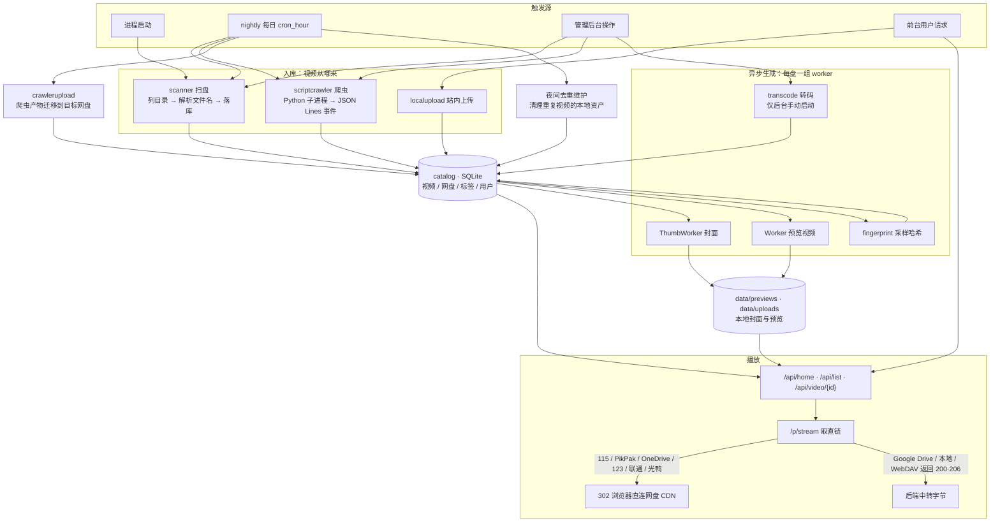
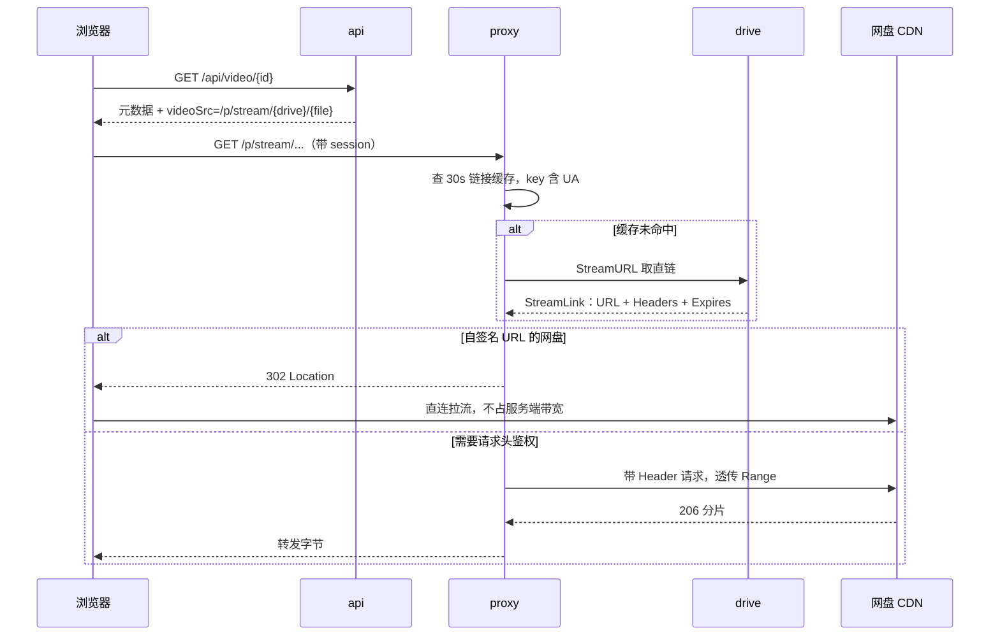
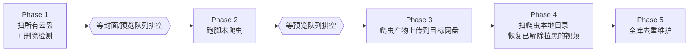

# backend

## 目录

仓库根目录是前端（Vite + React），`backend/` 是本文档描述的 Go 服务：

```
91/
  src/                      前端源码：admin/ 管理后台、pages/、components/、lib/、styles/
  tests/                    前端测试（node --test）
  index.html  public/       前端入口与静态资源
  scripts/  .github/        构建脚本与 CI
  install.sh  start.sh      一键安装、本地启动前后端
  deploy.sh  Dockerfile     部署
  backend/                  Go 服务，见下
```

`backend/` 的主干：

```
cmd/server/                 入口：加载配置、挂载网盘、注册路由、跑启动迁移
internal/
  api/                      前台接口与管理后台路由
  auth/                     管理员登录、会话、失败封禁
  catalog/                  SQLite 元数据与标签
  config/                   YAML 配置
  drives/                   网盘抽象 + 12 个驱动（含 Python 爬虫、站内上传）
  scanner/                  扫盘落库、文件名解析
  preview/                  ffmpeg 抽封面、生成预览视频
  proxy/                    播放直链代理与 302 策略
  fingerprint/              跨盘去重指纹
  nightly/                  每日维护流水线
  crawlerupload/            把爬虫产物迁移到目标网盘
  …                         转码、标签、字幕、相似度、路径与文件名规则等小包
data/                       运行时数据：主库、封面、上传、爬虫产物（不在版本库）
```

<details>
<summary>完整目录（每个包和关键文件）</summary>

### backend/

```
cmd/
  server/                   服务入口与装配
    main.go                 启动、加载配置、跑启动期迁移
    app.go app_status.go    应用状态、按盘的预览开关
    http.go                 chi 路由、CORS、真实 IP 解析
    drives.go               按 kind 构造并挂载网盘
    crawlers.go             脚本爬虫任务调度与凭证
    generation.go           封面 / 预览视频的重生入口
    blacklist.go            历史「隐藏」视频迁移为黑名单墓碑
    tag_maintenance.go      启动期标签迁移与清理
    video_maintenance.go    本地上传文件名迁移 + 夜间全库去重（精确指纹、标题/封面近重复）
    video_maintenance_content.go
                            夜间内容级去重通道：时长相等的视频比较 teaser 对齐帧
  dedupe-dryrun/            只读预演内容级去重会删哪些视频，不写库不删文件
  diag-115/ list-115-yingshi/ list-yingshi-children/ trace-parents/
                            一次性诊断工具，读库里的 115 cookie 列目录 / 追父目录，不参与服务运行

internal/
  api/                      REST 路由
    api.go                  前台接口：首页、列表、搜索、详情、点赞、收藏、字幕
    home_recommendations.go 首页推荐
    shorts_feed.go          短视频模式取流
    video_shares.go         一次性免登录分享链接
    storage_usage*.go       存储占用接口（含 unix / windows 分支）
    admin_*.go              管理后台：登录、网盘、爬虫、视频、标签、用户、设置
  auth/                     管理员 session、密码哈希、登录失败封禁
  catalog/                  SQLite 元数据层
    catalog.go              视频、网盘、扫描状态
    tag_*.go                标签 CRUD、匹配、分类、迁移、维护
    users.go video_shares.go
  config/                   YAML 配置与默认值
  drives/
    iface.go                Drive 接口 + 可选能力（Remover、GenerationStreamProvider 等）
    quark/                  夸克（自己实现，参考 OpenList quark_uc）
    p115/                   115（壳子 + SheltonZhu/115driver）
    p123/                   123网盘（含扫码登录）
    pikpak/                 PikPak（自己实现，参考 OpenList pikpak）
    wopan/                  联通网盘（壳子 + OpenListTeam/wopan-sdk-go）
    guangyapan/             光鸭网盘（参考 AList GuangYaPan）
    onedrive/               OneDrive（OpenList 在线续期 + Microsoft Graph 文件接口）
    googledrive/            Google Drive（自建 OAuth 续期 + Google Drive API；播放走后端代理）
    webdav/                 标准 WebDAV（扫描、代理播放、上传、移动和删除）
    localstorage/           本地目录扫描（服务器已有视频目录）
    localupload/            站内上传的伪网盘，文件落在 data/uploads/
    scriptcrawler/          自定义 Python 爬虫驱动
      crawler.go runtime.go 进程管理、事件流解析、v1/v2 协议校验与超时兜底
      metadata.go           CRAWLER_NAME / CRAWLER_PROTOCOL 解析
      dryrun*.go            后台「测试脚本」，含跨平台进程组终止
      neardupe.go           入库前的近重复判定
  scanner/                  扫目录 → 落库；filename.go 从文件名解析标题和作者
  preview/                  ffmpeg 抽封面、生成多段预览视频，含 worker 队列与限流冷却
  fingerprint/              采样 SHA256 指纹 worker，用于跨盘的文件级去重
  transcode/                探测是否需要转码 + 转码 worker
  proxy/                    /p/stream/*、/p/preview/* 代理与 302 直链策略
  streamhttp/               共享的重定向策略，跳转时不泄漏网盘凭据
  nightly/                  每日一条维护流水线：扫盘 → 爬虫 → 上传迁移 → 去重维护
  crawlerupload/            把爬虫落地的视频迁移到目标网盘并改写 catalog 行
  tagging/                  标签匹配规则、番号识别
  fixedtags/                内置标签包及其匹配规则
  mediasim/                 标题相似度 + 封面 SSIM + teaser 帧签名，供近重复判定使用
  mediaasset/               封面 / 预览视频的本地路径与文件名规则
  videoname/                扫描、上传、爬虫迁移共用的文件名与标题规则
  storageusage/             磁盘与各网盘占用统计

CRAWLER_PROTOCOL.md         crawler.v2 脚本协议
config.example.yaml         配置模板
vendor/                     依赖已 vendored，可离线构建
```

以下由运行时生成，不在版本库里：

```
config.yaml                 首次启动从 config.example.yaml 复制
data/video-site.db          SQLite 主库
data/previews/              封面与预览视频（storage.local_preview_dir）
data/uploads/               站内上传的视频
data/scriptcrawlers/        爬虫落地的视频
data/crawler-scripts/       后台导入的爬虫 .py 脚本
```

</details>

## 运行流程

### 总览



### 1. 启动装配

`cmd/server/main.go` 的顺序是刻意安排的：

1. 读 `config.yaml`（缺失则从模板复制）、建 `data/` 目录、打开 SQLite。
2. 挂载本地内置盘（`localupload`），启动指纹补扫协程。
3. 装配 `api.Server` / `api.AdminServer`，注册 chi 路由，挂前端静态资源。
4. **先监听端口**，再 `go attachExistingDrives(ctx)` 异步挂载云盘。云盘挂载要校验上游登录态，放在监听之前会拖慢启动。
5. 启动 nightly 流水线协程，等待退出信号，收到后 5 秒优雅关闭。

启动期还会跑一次性迁移：孤儿视频清理、config 管理员写入 users 表、隐藏视频转黑名单墓碑、标签迁移。

每挂载一个盘，就为它单独起 **封面 / 预览 / 指纹三个 worker**，并注册一个可独立取消的 context —— 后台「停止该盘任务」就是取消这个 context。

### 2. 入库的三条路径

| 路径 | 触发 | 关键行为 |
|---|---|---|
| 扫盘 | 夜间流水线、后台「重新扫描」 | 递归列目录，按扩展名过滤，`videoname` 解析标题/作者，`UpsertVideo` 落库 |
| 爬虫 | 夜间流水线、后台「重新扫描」（爬虫盘等同触发爬取） | 启动 Python 子进程，读 stdout 的 JSON Lines 事件流，逐条下载入库 |
| 上传 | 前台 `POST /api/upload` | 落到 `data/uploads/`，直接入库并立即排生成队列 |

扫盘结束后还有一步**删除检测**：本轮见到的 `file_id` 集合之外、且父目录在本轮走过的视频，判定为已从网盘删除。若本轮有目录报错（`stats.Errors > 0`）则整轮跳过检测 —— 宁可漏删，不可把「暂时列不出来」误判成「用户删了」。爬虫盘和站内上传不参与这个检测，它们有自己的生命周期。

### 3. 播放链路



设计要点：

- **302 白名单**只放「URL 自带签名、不依赖持久请求头」的网盘：115、PikPak、OneDrive、123网盘、联通、光鸭。Google Drive 的下载地址必须带 `Authorization`，只能中转；WebDAV 遵循上游 —— 上游给 3xx 就把不含凭据的直链交给浏览器，给 200/206 就由后端转发。
- **链接缓存 30 秒**，且不超过 `link.Expires`。缓存 key 包含 UA，因为 115 的签名与 UA 绑定。
- 每次取链和中转的结果都会回写网盘健康状态。浏览器主动断开、单个文件 404 不算网盘故障，只有真正影响整盘的错误才标记异常。
- 播放器的「三屏画面」可以带 `?tripleScreenRelay=1` 请求强制中转（WebGL 需要同源帧），受 `proxy.allow_forced_relay` 开关控制。

### 4. 异步生成

新视频入库即入队，队列按 video ID 去重，避免同一视频重复排队；每处理完一条 worker 休眠 500ms 节流。

- **封面**：`ffprobe` 探时长 → `ffmpeg` 抽帧。
- **预览视频**：30 秒以下最多 3 段、30 秒及以上固定 4 段，每段 3 秒。取点区间按时长分档：10 分钟以上在 20%–80% 之间均匀取，30 秒到 10 分钟避开片头片尾（5% 或 3 秒起、85% 前结束），30 秒以下从 10% 起。拼接后校验确有视频流；段数不足时只有在明确的降级路径下才接受 2 段，并留日志。
- **指纹**：读少量 Range 片段算 `sampled_sha256`，用于跨盘去重。除入库即时入队外，还有每分钟一次的补扫协程捞 `pending`。
- **转码**：不自动跑，由后台按盘手动启动。

**限流冷却**是这一层的横切设计：上游返回 429 / 403 / `activityLimitReached` 这类信号时，整盘进入冷却期，任务保留 `pending` 等下轮，而不是标记失败。联通和光鸭默认冷却 10 分钟。115 的签名链接被提前拒绝时会刷新一次直链重试。

### 5. 夜间流水线

每天 `cron_hour` 跑一次，后台「扫描所有网盘」按钮触发同一条流水线。五个阶段**串行**，且阶段之间会等生成队列排空：



最近一次成功启动的日期写在 `settings` 表的 `nightly.last_run_date`，重启后不会因为进程在 `cron_hour` 内崩溃过就重跑一遍。流水线没有固定时长上限 —— 网盘冷却可能让某个阶段跑很久。标签匹配**不在**流水线里全库重算，它是事件驱动的：新视频入库和管理员改标签规则时即时刷新。

### 6. 去重的三层

1. **同盘同文件**：`(drive_id, file_id)` 生成稳定视频 ID，重复扫描只更新同一行。
2. **入库时**：优先用网盘侧 `content_hash`，没有则退化为 `file_name + size_bytes`。
3. **跨盘文件级**：`content_hash` 或 `size_bytes + sampled_sha256` 相同的视频，前台列表和封面/预览生成队列只认最早入库的那条（软过滤，行还在库里）；夜间 Phase 5 再把同 `size + sampled_sha256` 的组硬去重——按本地资产完整度、入库时间选保留项，其余打重复墓碑并清理本地资产，**不删网盘源文件**，墓碑同时阻止后续扫描重新入库。
4. **跨盘内容级**（夜间 Phase 5）：teaser 选段起点只由时长决定，所以时长几乎相等（≥120 秒、相差 ≤2 秒）的两个视频即使压制、水印、标题、封面完全不同，teaser 对齐帧也来自同一源画面。对这类候选比较对齐帧灰度 SSIM，中位数 ≥0.92 判重（全库实测负样本几乎全部 <0.5），保留体积最大者，其余打重复墓碑并清理本地资产；纯色/黑场帧不参与统计。teaser 某段回退到备选起点造成整段错位时，对时长精确相等的候选再用双向逐帧最优匹配兜底（单帧 ≥0.95、双向 ≥75% 帧强匹配）。帧签名按 `(teaser size, mtime)` 缓存在 `previews/framesigs/`，teaser 重新生成自动失效；上线前可用 `go run ./cmd/dedupe-dryrun` 只读预演。
5. **人工复核**：0.80~0.92 的疑似对写入 `duplicate_review_pairs`，后台「重复复核」页并排展示两个版本，一键"保留此版本"（另一方按重复墓碑删除，走与夜间相同的删除路径）或"不是重复，忽略"（之后夜间不会再写回这一对）。

爬虫另有一层入库前的近重复判定：标题相似度 + 封面 SSIM 拦截同源重发；标题对不上时走同样的内容级通道（用候选 teaser 的选段时间戳从刚下载的本地视频抽帧比对），拦截「站外压缩版 vs 网盘原版」这类跨源重复，避免先上传网盘再等夜间清理。

### 7. 鉴权与分享

前台接口、`/p/stream`、`/p/preview`、`/p/thumb` 全部在鉴权组内，代理路由同样要登录，防止绕过 API 直接拉流。管理接口再加一层管理员校验。

登录失败 3 次永久封禁来源 IP，只能后台手动解除；只信任本机代理传来的 `X-Forwarded-For` / `X-Real-IP`。

一次性分享是独立链路：`POST /api/share/consume` 用一次性 token 换一个 HttpOnly 分享会话，之后 `/p/share/{shareID}/*` 每次请求都校验该会话，且只能访问绑定的那一个视频。链接首次打开后即失效。
