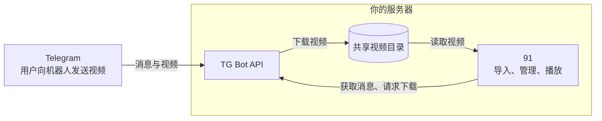

# `Telegram` - `TG Bot API` - `91` 的关系



接入 `Telegram` 需要部署一个 `TG Bot API` 服务，因为 `Telegram` 公共 Bot API 下载文件最多支持 20 MB

# 接入流程

## 1. 准备 `Telegram` 相关凭证信息

```text
Bot Token：向 Telegram 的 @BotFather 发送 /newbot 创建机器人后获取
API ID、API Hash：登录 my.telegram.org，在 API development tools 中申请
```

## 2. 部署 `TG BOT API` 服务

`TG BOT API` 服务需要通过 Docker 部署。`91` 项目有一键脚本和Docker Compose两种部署方式，这两个下 `TG BOT API` 服务的部署略有差别

<details>
<summary><b>一键脚本</b></summary>

**1. 编辑安装目录中的 `telegram.yml`**

```bash
cd /opt/video-site-91
sudo nano telegram.yml
```

**2. 在 `telegram.yml` 中补充完整以下字段**

```yaml
TELEGRAM_API_ID: "你的应用ID"
TELEGRAM_API_HASH: "你的应用Hash"
```

**3. 启动 TG BOT API 服务**

```bash
sudo docker compose -f telegram.yml up -d --pull always
```

**4. 重启项目**

```bash
sudo 91 restart
```

</details>

<details>
<summary><b>Docker Compose</b></summary>

**1. 进入存放 `91` 项目 `docker-compose.yml` 的目录，然后下载完整部署模板**

```bash
curl -fsSL https://raw.githubusercontent.com/nianzhibai/91/main/tg-docker-compose.yml -o tg-docker-compose.yml
```

**2. 将原来的 `docker-compose.yml` 替换成 `tg-docker-compose.yml`**

注意如果你之前手动修改过 `docker-compose.yml`，下面操作会替换 `docker-compose.yml`，你替换后需要再修改一次

```bash
mv docker-compose.yml docker-compose.yml.bak
mv tg-docker-compose.yml docker-compose.yml
```

**3. 编辑新的 `docker-compose.yml` 补充下面字段**

```yaml
TELEGRAM_API_ID: "你的应用ID"
TELEGRAM_API_HASH: "你的应用Hash"
```

**4. 启动 `TG Bot API` 并重建 `91` 容器**

```bash
docker compose pull && docker compose up -d
```

</details>

## 3. `91` Web 端配置

1. 在 **配置面板 → Telegram** 填写 Bot Token，启用 Telegram 并保存，进入 Telegram 页面测试连接
2. 私聊机器人发送 /id，将回复的数字填入 `91` 项目中 "允许的用户 ID" 并保存
