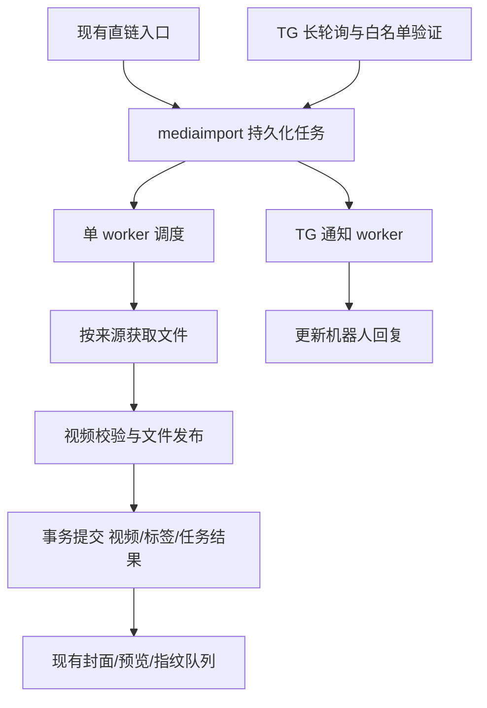

# Telegram 视频导入设计

状态：第一版已实现。核对日期：2026-09-14。部署步骤见 [Telegram 部署](telegram-setup.md)。

实现时收敛了以下细节，以下原设计中的相应草案以此为准：

- 公共流程位于 `mediaimport`，HTTP 获取与安全策略暂保留为该包内独立文件；物理表名沿用 `remote_upload_jobs`，增加来源、阶段和重试字段，避免对备份及视频去重引用做纯命名迁移。
- TG 凭据在“配置面板 → Telegram”管理并回显，统一保存在 `config.yaml` 的 `telegram` 段；公共磁盘余量继续使用现有 `remote_upload.disk_reserve_bytes`。
- 管理 API 沿用项目的 `/admin/api` 前缀。重试等待表示为 `queued` 状态加 `retry_wait` 阶段；消息回执以期望任务状态与已送达状态进行通知补偿。
- 来源载荷 30 天后清空，永久保留精简任务结果和消息幂等键，保证文件映射继续可用。
- 磁盘预检保守地要求视频盘容纳两份文件，再单独检查缓存盘；不提供自动缓存回收。

以下章节记录原始设计决策及其理由。

目标：用户把想保存的视频转发到自己的 Telegram 机器人，项目自动下载到本地视频库，并回复处理结果。

## 1. 第一版范围与关键决定

| 项目 | 决定 |
| --- | --- |
| 使用方式 | 单机器人，指定用户私聊转发或直接发送视频 |
| 消息类型 | `message.video`，以及 MIME 类型或扩展名表明是视频的 `message.document`；最终以媒体探测结果为准 |
| 大文件 | 自建官方 Telegram Bot API Server，启用 `--local` |
| 接收方式 | 后端长轮询，一个机器人仅运行一个接收实例 |
| 存储 | 现有 `local-upload` 视频库 |
| 任务 | 与直链导入共用持久化调度、校验和入库流程 |
| 并发 | 第一版全局一个导入 worker，先进先出；接收和通知独立运行 |
| 结果 | TG 回复任务状态，成功后提供站内详情链接 |
| 配置 | YAML 统一持久化，可视化与源码共用保存；支持热更新 |
| 去重 | 同一消息幂等，同一机器人收到的同一 TG 文件只保存一份 |

第一版不包括群组监听、历史消息抓取、`t.me` 链接解析、用户账号登录、视频转码和跨来源内容去重。相册按每条视频独立处理，不等待整组消息到齐。动画、圆形视频及付费媒体暂不接收。

保存的是收到的 TG 文件，不承诺还原发送者上传前的原始画质；“入库成功”也不等于所有浏览器都能直接播放该编码。

## 2. 平台约束与部署取舍

官方托管 Bot API 的 `getFile` 下载限制为 20 MB；本地模式解除该限制，并可返回已下载文件的绝对路径。`file_id` 用于获取文件，`file_unique_id` 用于识别文件，后者不能用于下载。[Bot API 文件说明](https://core.telegram.org/bots/api#getfile)、[本地模式](https://core.telegram.org/bots/api#using-a-local-bot-api-server)、[视频字段](https://core.telegram.org/bots/api#video)

本地服务另外需要 `api_id`、`api_hash`，与机器人 Token 是两组不同凭据。服务需要连接 Telegram；“Local”指自建 API 服务，不是离线工作。采用官方源代码构建并固定版本，不假设存在官方 Docker 镜像。[官方服务说明](https://github.com/tdlib/telegram-bot-api#usage)

长轮询和 webhook 不能同时使用；未消费更新最多保留 24 小时。云端迁移到本地需要先在云端执行 `logOut`，不能在每次启动时重复迁移。[更新接收](https://core.telegram.org/bots/api#getting-updates)、[迁移要求](https://github.com/tdlib/telegram-bot-api#moving-a-bot-to-a-local-server)

受保护的消息可能无法转发，此功能不覆盖该场景。机器人无需加入原群，鉴权依据是给机器人发送消息的人，不是原消息作者。[消息字段](https://core.telegram.org/bots/api#message)

候选方案比较：

| 方案 | 优点 | 代价与结论 |
| --- | --- | --- |
| 托管 Bot API | 部署简单 | 20 MB 限制不适合目标场景，不作为第一版路径 |
| Local Bot API | 机器人身份、大视频、官方 HTTP API | 增加服务和缓存目录；采用此方案 |
| MTProto / TDLib 客户端 | 可以做更深的客户端集成 | 增加会话、下载调度和协议依赖；当前需求不需要 |

## 3. 产品交互

后台“配置面板”增加“Telegram”分栏，与其他分栏共用 YAML 草稿、差异预览及管理员配置接口保存。“Telegram”分栏使用滑块启用接入，展示凭据、允许用户 ID、站点地址和始终展开的部署与下载设置。“Telegram”页面管理网盘转存配置，显示连接状态和导入记录，并提供连接检查、恢复接收及任务操作；网盘转存通过同一 YAML 接口独立保存，只更新改动字段并校验配置版本；导入记录使用公共任务 API。两个页面提供相互跳转入口。

连接设置展示启用开关、Bot Token、API ID、API Hash、机器人用户名、允许的用户 ID、站点地址；高级设置展示 Bot API 地址、共享缓存路径、大小及队列限制。连接状态区分“未启用”“等待配置凭据”“等待 Bot API 服务”“连接中”“连接正常”“连接异常”“接收冲突”，同时显示最近成功轮询时间、最近收到消息时间和最近错误。

配置流程：创建机器人 → 部署本地 Bot API → 在面板填写三项凭据和允许的用户 → 保存并应用 → 检查当前连接 → 转发一个视频验证。用户可向机器人发送 `/id` 获取自己的数字 ID；这个命令仅返回发送者本人的 ID，不授予导入权限。首次不知道用户 ID 时，可以空白名单启动连接，仅处理 `/id`；页面显示“等待设置允许的用户”，所有视频均拒绝导入。补齐白名单并重启后开始接收视频。

“测试连接”仅验证 Token、机器人身份、webhook 状态和共享目录是否可读；不消费消息、不发 TG 消息、不自动注销云端服务。连接测试不能证明大文件下载成功，首次视频导入才是端到端验证。

机器人交互示例：

```text
用户：转发一个视频
机器人：已加入队列 · TG-00123
        海边日落 · 268 MB

保存后更新为：
已保存 · 海边日落
封面和预览将在后台生成。
[打开视频]

重复发送：这个视频已经保存。[打开视频]
失败：保存失败：磁盘空间不足。任务 TG-00123，可在后台重试。
```

成功含义是文件持久化且视频记录已提交；封面、预览失败属于后续处理，不让导入任务退回失败。没有配置站点地址时仍可保存，只回复标题和任务编号。链接使用现有详情页，沿用站点访问权限，不自动创建一次性分享链接。

除 `/id` 外，`/start`、`/help` 和视频导入均检查白名单；未知用户不创建任务。暂不提供 TG 内的取消、重试按钮，统一在后台操作。

列表展示标题、来源、文件大小、阶段、提交时间、发送者 ID、失败原因及重试次数，支持状态筛选、游标分页、取消、重试和打开视频。普通上传页仅显示直链任务；TG 消息及发送者信息只在管理员页面显示。

## 4. 现有架构与改造边界

当前可复用部分：

| 位置 | 现有职责 |
| --- | --- |
| `backend/internal/mediaimport/manager.go` | 下载、临时文件、媒体校验、文件发布、任务恢复 |
| `backend/internal/catalog/remote_upload_jobs.go` | SQLite 任务状态、任务与视频及标签的提交事务 |
| `backend/internal/drives/localupload/driver.go` | 本地视频读取、播放路径、删除 |
| `backend/cmd/server/main.go` | 组装下载服务，通过 `enqueueUploadedVideo` 触发后续处理 |
| `backend/internal/config/manager.go` | YAML 原子写入、版本冲突检测、重启提示 |
| `backend/internal/backup/` | 按资源范围备份、路径改写、恢复时取消进行中的下载 |

主要设计问题：现有任务的输入固定是 URL，入库事务直接更新 `remote_upload_jobs`。只增加一个 TG 下载器会使重试、落盘恢复和入库事务重复实现；把 TG Token 拼进普通下载 URL 又会混淆凭据、文件标识和直链的访问控制。

选择将直链任务演进为公共 `mediaimport` 模块，限定两个明确来源 `http`、`telegram`。数据库事务、文件生命周期和调度由公共层负责；HTTP 和 TG 各自负责获取文件。使用明确的来源结构和构造时注入的获取器，不引入插件注册系统或消息中间件。



建议模块布局：

```text
backend/internal/mediaimport/     任务调度、恢复、媒体校验、发布
backend/internal/remoteupload/    HTTP 来源校验与获取
backend/internal/telegram/        Bot API 客户端、接收、文件获取、通知
backend/internal/catalog/         公共任务、TG 回执与去重映射
backend/internal/api/             管理接口和原直链接口适配
```

公共层不引用 TG 消息类型；来源获取器向公共层提供媒体信息，并把内容写入公共层创建的临时文件。TG 模块不自行写入视频表。原直链入口保留面向现有页面的适配，内部调用公共服务；浏览器文件上传仍沿用现有路径，本次不强制任务化。

## 5. 接收、排队和通知

1. 启动时调用 `getMe` 确定机器人数字 ID，检查 webhook。发现已有 webhook 时报告冲突，不静默删除；管理接入流程提供明确的“切换为轮询”操作，保留待处理更新。
2. 使用 `getUpdates` 长轮询，只请求 `message` 更新。一次只允许一个轮询请求；轮询超时建议 30 秒，HTTP 超时略长。
3. 逐条按返回顺序处理。验证私聊、白名单、类型、大小和待处理队列容量；提取必要字段，不存完整原始消息 JSON。
4. 一个数据库事务中写入消息回执、创建或关联任务、更新去重映射，并保存下一次 `offset`。不能先前移游标再写任务。
5. 事务提交后才用新 `offset` 发起下一次请求。崩溃后可能重复接收，由唯一约束消除重复；顺序不确定的未提交消息不能被越过。游标依照已提交批次推进，不把更新编号当作永不重置的业务序列。
6. 不支持或超过限制的消息记录拒绝结果并正常推进；数据库异常则停止推进并重试。队列满时明确回复“队列已满，请稍后重发”，不承诺已接收。
7. 通知 worker 独立读取待通知回执，先发送排队结果，再编辑同一回复为最终结果。任务已快速完成时可直接发送最终结果。

通知状态必须落库。回复被删除可以补发，用户屏蔽机器人则记录通知失败；这些情况都不重新下载视频。遇到 429 遵循 `retry_after`，网络故障退避。一个回执的通知操作串行，旧的排队通知不能覆盖最终结果。

TG 发送成功但响应丢失时，无法保证通知恰好一次，极端情况下允许重复回复；视频保存必须保持幂等。通知最多自动尝试 8 次，此后后台保留“结果通知失败”。

## 6. 任务生命周期与文件处理

```text
queued → fetching → validating → saving → completed
             ↓           ↓          ↓
          retry_wait / failed / canceled

retry_wait → queued
failed → queued（管理员重试）
```

取消：排队及等待重试的任务立即取消；执行中的任务写入取消标志，worker 检查后清理自己拥有的临时文件。最终提交事务与取消操作通过条件更新串行化，已完成任务不再取消。

文件获取分两段：

- `telegram_download`：调用本地 `getFile`，由 Bot API 服务从 Telegram 获取视频。界面显示阶段和耗时，进度为不确定，不伪造百分比。
- `local_copy`：校验返回路径后，将共享目录的文件复制进项目的 `.part` 文件，可以报告字节进度。

Bot API 实现会启动文件下载并等待文件结果；第一版不依赖未公开的下载进度接口。[官方实现](https://github.com/tdlib/telegram-bot-api/blob/master/telegram-bot-api/Client.cpp)

共享缓存采用固定绝对路径，例如 `/var/lib/telegram-bot-api`，两个容器挂载到相同路径；Bot API 可写，项目只读。读取前校验路径确实位于指定根目录内、不是越界符号链接且是普通文件，打开后再次核对文件信息。路径只来自受信任的服务响应，不能来自消息文字。

公共层在最终上传目录内创建临时文件，复制完成后检查实际大小、`ffprobe` 视频流和可接受容器类型；不把扩展名或 MIME 当作充分证据。文件名由项目命名规则产生，标题按“说明首个非空行 → 原文件名 → TG 视频 + 消息编号”选择并限制长度。完整说明只作私有来源信息，默认不公开原群组和原作者。

文件发布与数据库事务沿用现有恢复思想：先持久化临时/最终文件引用，再把文件持久化发布，最后同一事务提交视频、标签、任务结果和 TG 文件映射。发布不能覆盖已有文件。文件与 SQLite 无法形成单个事务，因此启动恢复必须区分“已提交的最终文件”和“未提交的残留”，绝不清理已成功入库的文件。

采用现有 `persistence` 锁协调备份/恢复及入库。停机或崩溃中断的任务回到队列，从文件获取步骤重试；不承诺断点续传。已提交结果但来不及触发后处理时，由现有后台扫描/协调机制补齐；实现时须验证封面、预览、指纹都能补偿。

下载重试建议：首次失败后最多自动重试 3 次，退避 10 秒、60 秒、300 秒并加抖动。网络错误、5xx、429 可重试；无效文件、格式不支持、超限不自动重试。鉴权失效暂停 TG 来源并显示连接异常，不能拖垮 HTTP 导入。

磁盘不足进入 `retry_wait` 并标明原因，条件恢复后再领取，不持续消耗下载重试次数。单次 TG 获取超时默认 30 分钟，可配置；不能套用直链的 120 秒无数据超时。取消 HTTP 请求不保证 Bot API 服务同时停止内部下载，后台取消仅保证本任务不再入库。

## 7. 数据模型与去重

所有下表均为拟新增/迁移后的结构，不是当前已有 API 或字段。ID 使用字符串传给前端；数据库中的 TG 用户、聊天、消息编号及文件大小使用 64 位整数。

| 表 | 关键字段与职责 |
| --- | --- |
| `import_jobs` | `id`、排队序号、`source_kind`、`source_payload_version`、`source_payload`、标题、标签快照、状态、阶段、字节数、取消标志、重试次数、下次尝试时间、错误码、临时/最终文件引用、结果视频 ID、时间戳 |
| `telegram_connections` | `bot_id` 主键、`next_update_offset`、`needs_reconnect`、最近成功轮询及消息时间；不存 Token |
| `telegram_receipts` | `bot_id`、`update_id`、`chat_id`、`message_id`、发送者 ID、关联任务或已有视频、拒绝原因、机器人回复 ID、期望/已发送通知版本、通知重试信息 |
| `telegram_files` | `(bot_id, file_unique_id)` 主键、最新 `file_id`、当前任务 ID、已保存视频 ID、更新时间 |

`source_payload` 是按来源区分、带版本的有限字段 JSON，Go 端使用明确结构体解析：HTTP 保存 URL；TG 保存 `bot_id`、`file_id`、`file_unique_id`、原文件名、大小、MIME 和必要说明。不保存 Token、完整下载 URL或缓存绝对路径；执行时从当前配置解析凭据并重新获取文件路径。

唯一约束：`telegram_receipts(bot_id, update_id)` 和 `(bot_id, chat_id, message_id)`。文件映射的查找、任务创建和关联在一个事务内完成，避免两个重复消息各建一份任务。

重复行为：

| 情况 | 处理 |
| --- | --- |
| 同一更新重投 | 返回已记录结果，不新建任务、不重复安排通知 |
| 相同文件已有运行任务 | 新回执关联已有任务，完成后各自通知 |
| 相同文件已保存且文件仍可用 | 回复已有视频链接，不下载、不修改既有标题及标签 |
| 前次失败或取消后重新转发 | 用最新 `file_id` 创建新任务并更新文件映射 |
| 视频被删除或文件缺失后重新转发 | 验证失效映射，创建新任务 |

管理员重试复用原任务，增加执行代次；仅在该文件映射仍指向此任务、没有更新的活动任务或有效视频时允许重试，否则返回当前任务/视频。新消息仍可提供更新后的 `file_id`。换 Token 后若 `getMe` 返回同一个机器人，继续原映射；换成不同机器人时绝不使用旧机器人的文件 ID，新旧状态隔离，旧任务等待原机器人恢复或管理员取消。

第一版只承诺 TG 文件身份去重。重新编码或重新上传可能产生不同文件标识；跨直链、本地上传、TG 的内容哈希去重属于后续扩展，不与已有媒体指纹查重混为一谈。

已结束的任务和通知正文保留 30 天，可清理来源说明及失败文件引用；未结束任务不得清理。消息幂等键保留为精简回执，TG 文件到视频映射随视频存续，不因任务历史过期而丢失。删除视频时清空结果映射，清理任务时使用可空引用，避免悬空外键。

## 8. 配置与接口

Telegram 设置和三项凭据保存在 `config.yaml` 的 `telegram` 段，通过配置管理器统一验证、原子写入和热更新。旧数据库的 `telegram_settings` 记录在启动时填补缺失的 YAML 字段，成功写入后清除；现有 YAML 字段始终优先。数据库继续保存消息、任务和接收游标，不再参与在线配置读写。

可视化分栏和源码编辑均显示凭据原值，共用版本冲突检查与差异确认。清空字段表示清空该值，启用接入前必须配置完整凭据。状态接口省略凭据，配套服务只读取从 YAML 派生的 API ID/API Hash 配置。站点备份不导出 `config.yaml`，迁移服务器时需单独保留此文件。

项目的 `Integration` 管理不可变的接收器会话。配置变更时先取消并等待旧接收器退出，再建立新会话；旧连接中的下载会等待重连后重试。配套 Python 管理程序读取项目原子生成的 API 配置文件，停止旧 Bot API 进程后使用新 API 凭据启动，退出时回收子进程，异常退出则重试。派生配置不携带 Bot Token；独立状态文件只包含配置修订标识、运行状态和心跳时间，项目确认修订匹配且心跳有效后才启动接收器。

TG 导入不提供自定义默认标签；入库时统一添加 `TG` 来源标签，内容标签沿用现有自动匹配规则。任务执行前复核发送者仍在当前白名单中。转存任务执行时读取当前持久化配置，确认上传成功后删除项目中的本地原视频。

管理员接口：

| 接口 | 用途 |
| --- | --- |
| `GET /admin/api/config.yaml` | 读取统一 YAML 配置（包含 Telegram 凭据）及版本号 |
| `PUT /admin/api/config.yaml` | 验证并原子保存统一配置，热更新 Telegram 连接 |
| `GET /admin/api/telegram/status` | 当前运行状态、机器人公开信息、脱敏错误、空间状态 |
| `POST /admin/api/telegram/test` | 检查当前已应用的配置，结果不携带凭据 |
| `POST /admin/api/telegram/prepare-polling` | 明确执行 webhook 切换，保留待处理更新；与运行接收器互斥 |
| `POST /admin/api/telegram/resume` | 恢复备份后验证当前机器人连接，解除 `needs_reconnect`，恢复接收 |
| `GET /admin/api/import-jobs` | 来源/状态筛选、游标分页 |
| `POST /admin/api/import-jobs/{id}/cancel` | 幂等取消 |
| `POST /admin/api/import-jobs/{id}/retry` | 校验来源和文件映射后重试 |

配置保存使用统一的 `/admin/api/config.yaml` 接口及版本冲突检查。任务 DTO 只输出展示字段，不输出原始来源载荷。列表进度允许 `null`，表示该阶段没有可靠百分比。HTTP 原入口始终固定 `source_kind=http`，客户端不能借此提交 TG 来源或私有服务地址。

## 9. 部署、容量和运行行为

Docker 增加可选 Compose 配置和单独的 Bot API 镜像构建文件，普通部署不启动 TG 服务。两个服务共享 Bot API 数据卷，项目对其只读；项目视频目录仍为原持久化卷。Bot API 的容器端口统一为 7878；全 Docker 部署仅供内部网络访问，网站原生部署时映射到宿主机的 `127.0.0.1:7878`，无需映射到公网。

面板统一接收三项凭据；项目通过专用配置卷向配套服务传递 API ID/API Hash，管理程序再注入 Bot API 子进程的环境，用户无需编辑环境文件。非 Docker 部署使用同一管理程序和相同的路径约定。项目禁用 TG 时无需本地服务即可启动；启用但服务暂时不可达时显示异常并重试，网站和 HTTP 导入仍可用。

首次连接已有机器人时，运维步骤明确执行云端注销和 webhook 检查，再启动本地接收；文档给出命令，避免在测试按钮中隐藏这些操作。Bot API 版本固定后进行大文件验收，升级时重新执行相关测试。

一次导入可能同时占用 Bot API 缓存和项目视频两份空间；如果同一文件系统，至少按约 `2 × 文件大小 + 保留空间` 预检，分盘时分别检查。文件大小未知则预留配置最大值，并在复制时检查实际大小。空间预留由公共调度协调，复制中持续检查，不只依赖一次磁盘查询。

应用只清理自己创建的 `.part` 和未提交最终文件。Bot API 缓存不作为视频库，不被项目移动、硬链接后删除或直接清理。第一版为缓存卷设置独立容量预算和低水位告警，空间不足暂停 TG 获取；运维清理必须使用经固定版本验证的服务端方式。自动缓存回收不在第一版范围，部署文档必须写明维护责任及操作，不假设缓存自动无限回收。

监控至少覆盖：轮询健康、接收延迟、队列长度、获取耗时、失败次数、通知失败、项目盘和缓存盘可用空间。多个进程使用同一 Token 时出现接收冲突，应停止竞争并显示错误，不不断重试抢占。

## 10. 数据迁移、备份与恢复

将 `remote_upload_jobs` 迁移为 `import_jobs`：保留任务 ID、顺序、结果引用和所有残留文件路径，来源设为 HTTP。迁移在启动 worker 前完成；原有活动任务经新恢复流程重新排队。旧版本已删除 URL 的失败任务不能重试，界面要求重新提交链接。

备份/恢复目前直接引用 `remote_upload_jobs`，必须同时更新归档表校验、导出裁剪、合并恢复和路径改写，不能只改在线数据库。旧备份先迁移结构，再执行新的校验规则。

备份包含本地上传存储时，保留完成任务及文件到视频的有效映射；不包含时清空对应任务和 TG 文件映射。来源凭据、接收游标、待发送通知和消息正文不进入可移植归档。源运行库不受归档裁剪影响。

恢复时取消未完成导入、清除通知待发送状态并停止 TG 接收；恢复目标进入持久化的 `needs_reconnect` 状态。管理员完成连接检查并执行“恢复接收”后才继续，不自动消费旧消息或给旧聊天发通知。“恢复接收”保留 Telegram 当前尚可获取的更新并按文件映射去重，不承诺补回超过平台保留期限的消息。此状态和恢复动作接口与实现一并加入。

## 11. 实施顺序与验收

1. 提取公共导入流程，迁移现有 HTTP 任务及备份规则，先验证现有直链行为。
2. 增加 TG 客户端、持久化接收和文件映射，用模拟 Bot API 验证消息与任务事务。
3. 接入真实本地 Bot API、共享文件读取和大文件保存，再接入通知 worker。
4. 完成后台连接页、任务列表、配置校验、脱敏和自动应用状态。
5. 提供可选部署文件与操作文档，执行真实机器人验收。

必要验收场景：

- 视频与视频 document 能保存；伪装视频和超限文件拒绝；非白名单用户不产生任务。
- 文件超过 20 MB，至少包含一个 GB 级样本，能够经本地 Bot API 入库。
- 同一消息重投、同一文件连续转发或下载中重复转发，只产生一个有效视频。
- 任务提交前后、文件发布后、数据库提交后分别注入崩溃，恢复后不丢已完成视频、不产生重复入库。
- 取消与最终提交竞争，磁盘不足，Bot API 断线、超时、429、Token 失效和接收冲突均有明确结果。
- 本地获取阶段没有虚假百分比；通知失败不影响已经成功保存的视频。
- 路径越界、符号链接、凭据进入日志及 HTTP 接口伪造 TG 来源均被阻止。
- 相同文件删除后可重新保存；旧失败任务不能绕过新任务的去重约束。
- 重启能恢复队列；更换机器人不误用旧文件 ID；撤销白名单后排队任务不能继续入库。
- 旧数据库和旧备份可迁移，恢复不自动发送旧通知，开启接收需完成恢复连接步骤。
- 现有直链导入、普通上传、视频播放、封面/预览及备份恢复相关回归通过。

完成标准：用户从 TG 转发一个允许范围内的视频后，无需再打开网站操作即可完成保存；后台和机器人对任务结果保持一致，发生重试或重启也不会重复入库。
