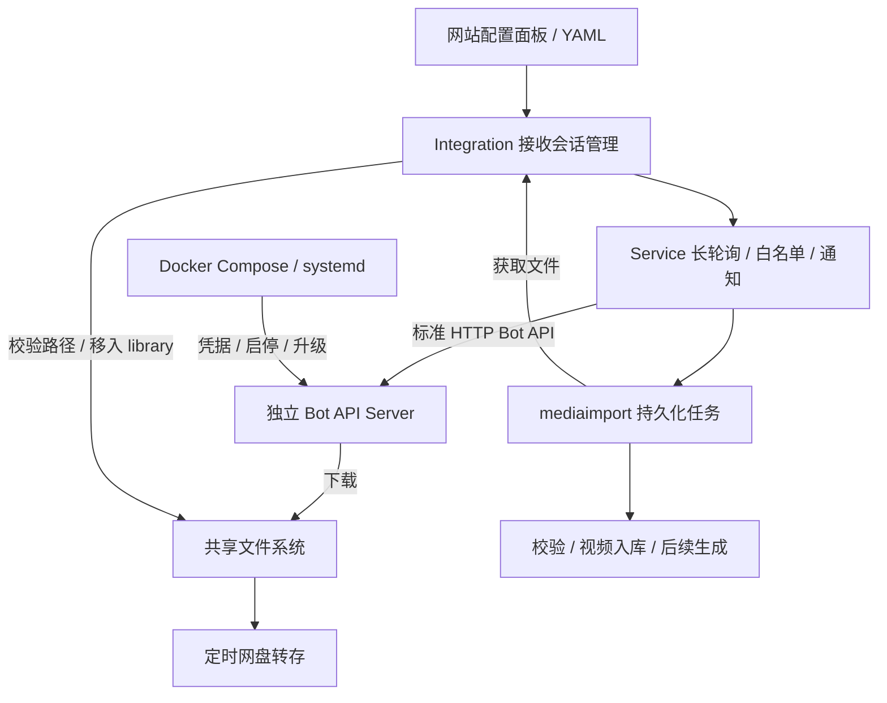

# Telegram 视频导入设计

当前实现通过标准 HTTP Bot API 接口连接独立部署的 Telegram Bot API Server。部署步骤见 [Telegram 部署](telegram-setup.md)。

## 职责边界

| 组件 | 职责 |
| --- | --- |
| `config.Manager` | 验证并持久化网站 YAML，启动时读取 Compose 挂载并提供运行时配置快照 |
| `telegram.Integration` | 应用配置，串行替换项目接收会话，向公共导入流程提供文件来源 |
| `telegram.Service` | 机器人身份验证、长轮询、白名单、文件获取、结果通知 |
| `telegram.client` | 标准 HTTP Bot API 请求、响应解码、错误脱敏 |
| 独立 Bot API Server | 与 Telegram 通信、下载文件；凭据和进程由部署工具管理 |
| `mediaimport` | 持久化任务调度、视频校验、入库、取消和恢复 |
| `catalog` | 消息幂等、接收游标、文件映射、任务及视频事务 |
| `telegramstorage` | 读取和删除项目已登记的 TG 本地文件 |
| `telegramupload` | 定时将本地 TG 视频转存网盘，确认成功后切换来源并清理本地原视频 |

网站不发布 Bot API 启动配置，不管理服务端进程，也不读取服务端的专用心跳文件。连接条件由标准 HTTP 接口和共享文件访问决定，服务端的镜像名称不参与业务判断。

## 配置与部署

网站 YAML 保存 Bot Token、Bot API 地址、允许用户、站点地址、文件与任务限制以及网盘转存设置。目录唯一来源是部署的 Compose 文件；原生默认读取网站配置同目录的 `telegram.yml`，启动环境 `VIDEO_TELEGRAM_COMPOSE` 可指定另一文件。两端目录不进入网站 YAML 或状态 JSON，也不在 Web 中展示或编辑。API ID/API Hash 属于 Bot API 服务的应用凭据，保存在独立部署配置中，不进入网站运行时配置。

默认的可选 Compose 部署使用 `aiogram/telegram-bot-api:latest`，通过 `TELEGRAM_LOCAL=1` 启用 Local 模式，通过 `TELEGRAM_HTTP_PORT=7878` 对齐网站默认地址。项目不编译或发布 Bot API 镜像，也不要求使用这个特定镜像。兼容服务必须提供所用的标准接口和 Local 文件语义。[镜像说明](https://hub.docker.com/r/aiogram/telegram-bot-api)、[官方服务说明](https://github.com/tdlib/telegram-bot-api)

网站在启动时读取 `telegram-bot-api` 的默认数据目录挂载。文件中只有 Bot API 服务时，宿主机 bind 源就是原生网站的读取目录；同时定义 `video-site-91` 时，通过相同数据源匹配两个服务的挂载，使用网站容器内目标路径。支持明确的短格式和长格式挂载，拒绝不明确、只读或嵌套覆盖的数据目录；不执行多文件合并和路径环境变量插值。读取错误保留为 Telegram 连接错误，不回退到默认根目录。配套文件默认在两端使用 `/var/lib/telegram-bot-api`。全 Docker 部署只在内部网络开放 API；原生后端配套部署只发布到 `127.0.0.1:7878`。服务重启、版本升级和 API 应用凭据更新由部署工具负责。

## 连接和会话生命周期

`Integration` 消费配置管理器提供的有效快照，每秒检查接收配置是否变化。配置变化时先取消并等待旧接收器退出，再创建新接收器，避免重叠轮询。网盘转存配置不参与接收会话版本，修改它不会中断下载。

启用后，接收器通过 `getMe` 确认机器人身份，通过 `getWebhookInfo` 检查 webhook 冲突，并检查共享目录能否读取。标准接口已就绪即可开始接收，不要求 `panel-status.json` 或服务端配置修订标识。

管理接口的连接测试直接读取已保存的配置，可在接收会话尚未启动时执行；仅检查身份、webhook 和目录，不启动轮询、不消费更新、不发送消息。完整文件路径、写权限和大文件获取仍需通过实际导入验证。

网络或服务错误触发等待重试，服务恢复后继续使用持久化游标。轮询 409 冲突会停止接收，管理员应停止其他实例后重启当前项目。已有 webhook 需要显式切换为轮询，`deleteWebhook` 保留待处理更新。关闭网站接入停止项目接收、通知及活动获取，不控制独立 Bot API 的运行状态。

更换机器人后，旧任务只能由原机器人继续获取文件；更换 Token 后若机器人身份相同，可继续使用原文件映射。配置切换导致的下载取消转换为等待可用状态，避免将重连误判为永久失败。

## 消息、任务和通知

- 只接收指定用户的私聊视频及可识别为视频的文档；最终以媒体探测结果为准。
- `/id` 返回发送者自己的数字 ID，允许空白名单时完成配置；不授予导入权限。
- 长轮询仅请求 `message` 更新，超时 30 秒，HTTP 请求超时 40 秒。
- 每条更新在事务中保存回执、创建或关联任务、更新文件去重映射并推进游标。提交成功后才使用新的 offset 请求更新。
- 同一消息重投不创建重复任务；同一机器人收到相同文件时关联已有任务或视频。去重依据 TG 文件身份，不承诺跨来源内容去重。
- TG 与直链导入共用一个导入 worker。接收和通知独立运行，任务执行前再次检查发送者白名单与机器人身份。
- 回执持久化，通知通过编辑同一条消息反映任务状态。通知失败不重新下载视频，429 遵循 `retry_after`。

未消费的 Telegram 更新最多保留 24 小时。长期离线后需要核对近期转发记录。[更新接收说明](https://core.telegram.org/bots/api#getting-updates)

## 文件获取与所有权

1. 任务先在数据库中登记文件 ID 和任务归属；文件位于网站侧共享目录的 `library/<fileID>`，不保存主机绝对路径。
2. 调用 `getFile`，由独立 Bot API 下载视频并返回绝对路径。
3. 按启动时从 Compose 解析的挂载关系，检查返回路径位于 Bot API 数据目录下，将相对路径映射到网站可访问的根目录；检查本地解析后的路径未越界、文件是普通文件且大小符合消息信息和当前限制。
4. 通过同一文件系统内的重命名，将下载文件移入共享根目录下的 `library/`。
5. 确认落盘后向 `mediaimport.FileSource` 返回文件位置和存储标识；公共层执行媒体校验及事务入库。

文件接管不复制，不回退到跨文件系统复制。`library/` 是正式视频目录，不能单独挂载另一块盘，也不能当作 Bot API 临时缓存清空。播放、封面、预览和转存都读取同一份已入库的视频。

公共导入层不需要了解服务端镜像或凭据。获取器负责文件持久化；校验失败、取消、删除和转存后的清理由项目登记的文件映射限定，不清理服务端会话或其他缓存。

默认单文件上限为 4 GiB，待处理任务上限为 100，获取超时为 30 分钟。磁盘预检检查共享文件系统，保留空间沿用 `remote_upload.disk_reserve_bytes`。实际文件大小仍需下载后检查。获取阶段使用不确定进度，取消项目请求不保证服务端内部下载同时停止。

上述方案要求两个根目录指向同一份共享数据，不要求两端使用相同绝对路径。路径转换拒绝目录越界，本地读取继续检查符号链接边界。无共享目录的跨主机 HTTP 文件传输属于另一个文件获取方案，当前未实现。

## 存储、转存和恢复

`telegramstorage` 通过数据库中的不透明文件 ID 访问视频，统一将 `library/<fileID>` 解析到网站侧共享根目录，客户端不能直接指定服务端缓存路径。旧表中的绝对根目录列在数据库初始化时移除，文件 ID、任务和视频关联保留。关闭接入或更换机器人不影响已有视频。

目录迁移需要停止两端服务、搬移完整数据、修改实际使用的 Compose 数据挂载，重建容器并启动网站。播放、生成、删除、任务恢复、转存和备份都使用这一存储解析规则；搬迁后无需逐条更新视频记录。播放不缓存物理文件路径，转存和文件备份各自使用一次操作开始时的目录快照。目录配置不代表自动搬移文件，也不支持将旧视频留在另一根目录。

定时转存读取执行时的目标网盘配置。上传后验证文件大小及可用播放地址，提交视频来源切换，再删除本地原视频；失败时保留本地文件。网盘转存沿用现有视频 ID，因此原详情链接、标签和交互记录保持关联。

重启后，已经接管的文件直接复用，未完成获取的任务重新请求 Bot API。任务和视频提交沿用公共持久化协调，不承诺下载断点续传。30 天后清理已结束任务的来源载荷，保留精简结果和消息幂等键。

站点备份可以包含已登记的本地 TG 视频和有效文件映射，不包含 Bot API 会话、缓存数据库和网站 YAML。部署迁移时单独保存网站配置、Compose 文件及 Bot API 应用凭据。恢复的视频进入普通本地视频库并保留 TG 来源；恢复后暂停接收，由管理员确认后恢复。

## 验证范围

自动测试覆盖无需专用管理协议的标准 API 接入、配置热更新、禁用状态下的连接测试、外部服务中断后恢复、活动获取在配置变更时取消与重试，以及 Compose 挂载识别、缺失和无效挂载拒绝、目录不进入 Web 配置、路径映射与越界拒绝、绝对目录记录转换、整库搬迁后的播放、删除、获取恢复、转存和备份。

部署验证还需检查实际镜像启动参数、运行用户、共享目录权限。真实 Telegram 凭据、大文件下载和网盘网络链路通过部署后的实际导入验证。
